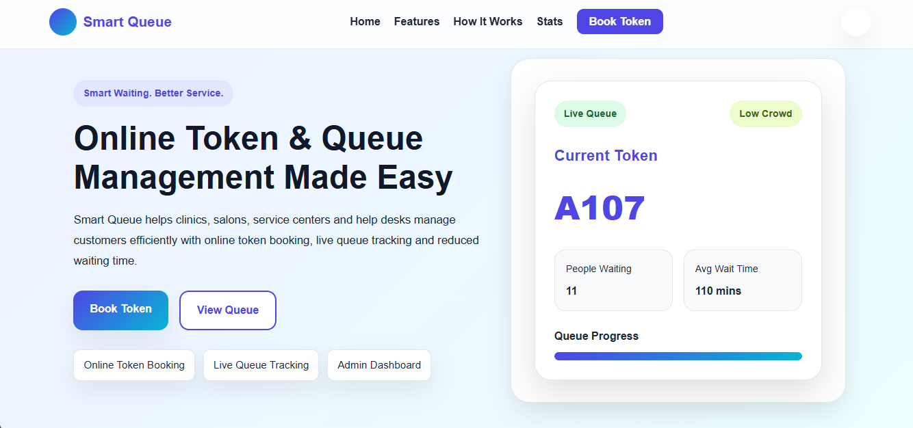
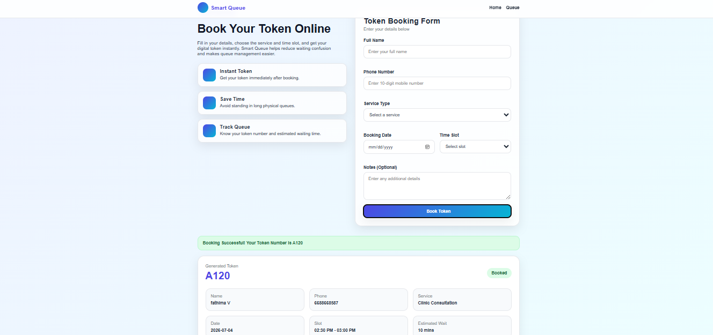
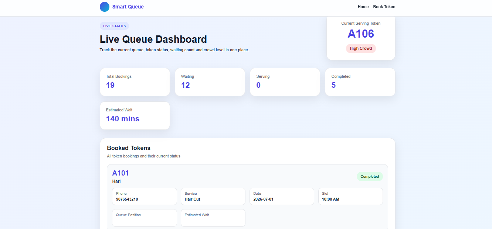
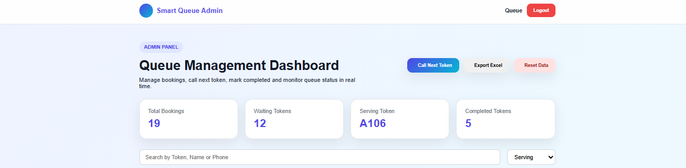
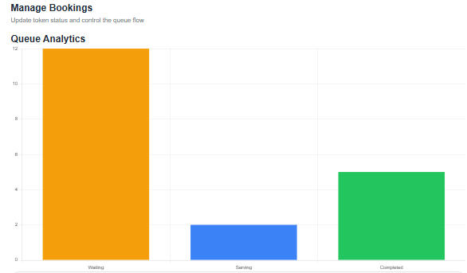

# Smart Queue - Full Stack Queue Management System

## 📌 Project Overview

Smart Queue is a Full Stack Queue Management System developed using HTML, CSS, JavaScript, Node.js, Express.js, and MongoDB Atlas. It allows customers to book tokens online, monitor live queue status, and enables administrators to efficiently manage the queue through an interactive dashboard.

The system reduces waiting time, improves customer experience, and simplifies queue management for organizations such as clinics, banks, salons, document verification centers, and service centers.

---

## 🚀 Features

### Customer Module
- Online Token Booking
- Automatic Token Generation
- Form Validation
- Estimated Waiting Time
- Queue Position Display
- Live Queue Tracking

### Admin Module
- Secure Admin Login
- View All Bookings
- Search Bookings
- Filter by Status
- Start Serving Token
- Complete Token
- Delete Booking
- Call Next Token
- Queue Analytics Dashboard
- Export Booking Data to Excel

---

## 🛠️ Technologies Used

### Frontend
- HTML5
- CSS3
- JavaScript

### Backend
- Node.js
- Express.js

### Database
- MongoDB Atlas
- Mongoose

### Libraries
- ExcelJS
- Chart.js
- CORS
- Dotenv

---

## 📂 Project Structure

```
SmartQueue
│
├── frontend
│   ├── css
│   ├── js
│   ├── pages
│   └── index.html
│
├── backend
│   ├── config
│   ├── controllers
│   ├── models
│   ├── routes
│   ├── package.json
│   └── server.js
│
├── Screenshots
├── README.md
└── .gitignore
```

---

## ⚙️ Installation

### 1. Clone Repository

```bash
git clone https://github.com/yourusername/SmartQueue.git
```

### 2. Backend

```bash
cd backend
npm install
npm start
```

### 3. MongoDB

Create a `.env` file inside backend.

```
MONGODB_URI=Your_MongoDB_Atlas_URL
PORT=3000
```

### 4. Frontend

Open

```
frontend/index.html
```

using Live Server.

---

## 📸 Screenshots

### Home Page



---

### Booking Page



---

### Queue Page



---

### Admin Dashboard



---

### Analytics Dashboard



---

## 📊 System Workflow

1. Customer books a token.
2. Booking details are stored in MongoDB Atlas.
3. Token is generated automatically.
4. Customer can view queue position and estimated waiting time.
5. Admin manages the queue using the dashboard.
6. Dashboard updates the live queue and analytics automatically.

---

## ✨ Future Enhancements

- Email Notification
- SMS Notification
- QR Code Token
- Online Payment Integration
- Multi-Branch Queue Management
- Customer Feedback System
- Admin Role Management

---

## 👨‍💻 Author

**CHANDRU**

Bachelor of Engineering

Information Technology

---

## 📜 License

This project is developed for educational and internship purposes.
